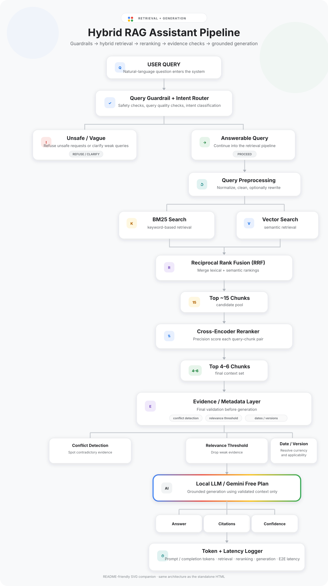

# SAITC-Applied-AI-Engineer-Take-Home-Assignment

## Implementation

### 1. Corpus ingestion
The corpus contains 13 text-based PDFs and a machine-readable
metadata manifest.

The ingestion pipeline uses PyMuPDF for text extraction and
`corpus_manifest.json` as the primary source of document metadata.

Metadata including document ID, version, effective date, owner,
classification, and supersession information is attached to every
retrievable chunk. This allows downstream retrieval and reasoning
components to distinguish newer and superseded documents.

The assignment reference date is fixed through configuration as
`2026-08-27`, matching the corpus instructions.

Retrieved document text is preserved as-is during ingestion,
including text that resembles instructions to an AI assistant.
Such content is treated as untrusted evidence rather than executable
instructions by the downstream safety and generation layers.

Chunking is section-aware with a bounded token size rather than
pure fixed-width splitting. This was chosen to preserve policy
clauses, tables, headings, and nearby explanatory text.

#### 1. Chunking iteration

The initial ingestion implementation produced 26 chunks for the
13-document corpus, effectively resulting in approximately one chunk
per PDF page.

Inspection showed that this grouped multiple independent policy
sections into the same embedding unit. For example, annual leave
entitlement, accrual, requesting leave and carry-over could appear
inside a single chunk.

The chunking strategy was therefore changed to section-first
chunking. Numbered document sections are preserved as independent
retrieval units where possible, with token-based splitting used only
when an individual section exceeds the configured maximum size.

The maximum chunk size is kept below the embedding model's context
limit to avoid silent truncation during embedding generation.

Repeated page headers, footers and metadata blocks are excluded from
semantic text because equivalent values are stored as structured
metadata. Deliberately adversarial document content is not removed.

#### 2. Chunk granularity refinement

The first section-aware implementation over-segmented the corpus,
producing 169 chunks with an average size of only 46.4 tokens and
some chunks containing as few as two tokens.

Inspection indicated that numbered procedural steps were sometimes
being interpreted as document section headings. Heading detection
was therefore tightened and a conservative minimum chunk threshold
was introduced.

Very small neighbouring fragments are merged only when the resulting
chunk remains below the target size. Legitimately concise clauses
and tables are still preserved independently where they represent a
useful retrieval unit.

This resulted from iterative inspection of the corpus rather than
selecting a fixed chunk size in isolation.

### 2. Semantic retrieval

Document chunks are embedded locally using
`BAAI/bge-small-en-v1.5`.

Embedding inputs include the document title and detected section
heading in addition to the original chunk text. This gives short
clauses additional semantic context without modifying the source text
used for generation and citations.

Embeddings are L2-normalized and stored in a FAISS `IndexFlatIP`
index. Inner-product search over normalized vectors is therefore used
as cosine-similarity retrieval.

The initial semantic retriever intentionally returns a larger
candidate set than will ultimately be sent to the language model.
These candidates are later combined with lexical BM25 results,
fused, and reranked.

A known ingestion limitation is that some PDF tables are fragmented
across neighbouring chunks. Rather than introducing significantly
more layout-specific parsing logic, the retrieval layer may expand
high-ranking evidence with adjacent chunks from the same source.

Known limitation:
  Table / cross-page fragmentation
  - handled downstream using retrieval expansion

### 3. Initial semantic retrieval observations

Semantic retrieval was tested independently before adding lexical
search or reranking.

The retriever reliably identified the correct document family for
annual leave, probation, pricing, refunds, and vendor onboarding.
However, the experiment also exposed an important limitation of
embedding-only retrieval: fragmented table rows can individually rank
high while lacking enough surrounding context to interpret them
correctly.

For example, isolated notice-period and refund-window table cells could
appear highly relevant without preserving the employee-status or plan
relationship required to interpret the value.

To address this without increasing PDF-parser complexity, the retrieval
pipeline uses contextual neighbour expansion after hybrid retrieval.
Adjacent chunks from the same source can be added as candidates before
cross-encoder reranking.

This also demonstrates why raw vector similarity is not treated as
evidence confidence.

### 4. Initial semantic retrieval observations

Semantic retrieval was tested independently before adding lexical
search or reranking.

The retriever reliably identified the correct document family for
annual leave, probation, pricing, refunds, and vendor onboarding.
However, the experiment also exposed an important limitation of
embedding-only retrieval: fragmented table rows can individually rank
high while lacking enough surrounding context to interpret them
correctly.

For example, isolated notice-period and refund-window table cells could
appear highly relevant without preserving the employee-status or plan
relationship required to interpret the value.

To address this without increasing PDF-parser complexity, the retrieval
pipeline uses contextual neighbour expansion after hybrid retrieval.
Adjacent chunks from the same source can be added as candidates before
cross-encoder reranking.

This also demonstrates why raw vector similarity is not treated as
evidence confidence.

### 5. Reranking limitations

Cross-encoder reranking improves candidate ordering in several cases,
but it is not treated as an authority signal.

During retrieval testing, the reranker occasionally assigned high
scores to semantically related but factually inappropriate evidence,
including API limits for a pricing question and post-probation notice
periods for a probation notice query.

For this reason, reranker scores are used only for candidate ordering.
The downstream evidence layer retains strong hybrid-retrieval
candidates and evaluates source metadata, effective dates, conflicts,
and evidence sufficiency before generation.

  

#### 3. Chunk granularity refinement

The first section-aware implementation over-segmented the corpus,
producing 169 chunks with an average size of only 46.4 tokens and
some chunks containing as few as two tokens.

Inspection indicated that numbered procedural steps were sometimes
being interpreted as document section headings. Heading detection
was therefore tightened and a conservative minimum chunk threshold
was introduced.

Very small neighbouring fragments are merged only when the resulting
chunk remains below the target size. Legitimately concise clauses
and tables are still preserved independently where they represent a
useful retrieval unit.

This resulted from iterative inspection of the corpus rather than
selecting a fixed chunk size in isolation.

Known limitation:
  Table / cross-page fragmentation
  - handled downstream using retrieval expansion

  

